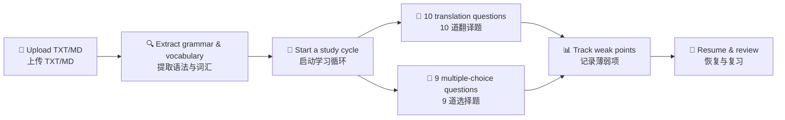

# Lingua Web

> 基于自定义日语材料与 AI 反馈的学习原型 · A Japanese Learning Web Prototype Powered by Custom Materials and AI Feedback  
> 三天自用原型已完成 · Three‑day self‑use prototype completed

[简体中文](#简体中文) | [English](#english)

---



---

## 简体中文

### 项目简介

Lingua Web 是一个自用日语学习 Web 原型，用三天时间完成了从材料上传到智能学习循环的全部核心流程。用户上传 TXT、Markdown 或 PDF 格式的日语学习材料，系统自动提取语法点和词汇，然后引导用户完成包含翻译题和选择题的完整学习循环，并自动追踪薄弱项以优化后续复习。

### 当前已实现功能

- **材料上传与提取** — 上传 TXT/Markdown/PDF 日语材料，通过 DeepSeek 提取语法点（含级别标注和原文示例）和词汇，示例验证通过后方持久化入库。PDF 文件优先直接提取嵌入文本，不足时自动切换至 OCR（tesseract）识别。
- **引导式学习循环** — 从已提取的语法点中优先选择 N2 级别的两个作为语法 A 和 B，生成语法解释、10 道翻译题（A/B 各 5 道）和 9 道选择题（4 道辨析 + 5 道复习），共 19 道题
- **智能评分** — 翻译题由 DeepSeek 进行结构化语义评估（判断是否使用目标语法、语义是否可接受），选择题由 Python 进行确定性判定
- **薄弱项追踪** — 自动记录每道错题对应的语法薄弱项；同一语法点答错 2 次后自动激活；后续循环的复习题优先使用活跃薄弱项
- **学习恢复与模块操作** — 未完成的循环可中断后精确恢复；支持跳过当前模块（不计入有效完成）和标记已学过（计入有效完成）
- **成本追踪** — 记录所有 DeepSeek API 调用的 token 用量并估算成本

### 实际学习流程

1. 打开 `/materials` 页面上传 TXT、Markdown 或 PDF 格式的日语材料（扫描件自动 OCR）
2. 系统自动调用 DeepSeek 提取语法点和词汇，于详情页展示
3. 在素材列表点击「开始学习」，系统选取两个语法点，生成 19 道题
4. 逐题作答：翻译题输入日语，选择题选择 A/B/C/D
5. 每道题后显示反馈（翻译题显示评分理由和修正答案，选择题显示正确答案）
6. 全部 19 题完成后显示正确率及每题详情
7. 薄弱项自动记录，可在 `/weak_points` 页面查看
8. 下次学习时，系统优先使用活跃薄弱项作为复习题源

### 系统架构

```
用户浏览器 → FastAPI 服务 → SQLite 数据库
                  ↓
           DeepSeek API
```

**边界划分：** DeepSeek 负责语言内容的提取、生成与翻译答案的语义评估；Python Runtime 与 SQLite 负责确定性流程推进、判题写入、薄弱项更新、会话恢复与完成判定。

### 技术栈

| 层次 | 技术 |
|------|------|
| 语言 | Python 3.11 |
| Web 框架 | FastAPI |
| 数据库 | SQLite + SQLAlchemy 2.x |
| 模板 | Jinja2（服务端渲染 + HTMX 表单交互） |
| 包管理 | uv |
| AI | DeepSeek API（OpenAI 兼容 SDK） |

### 目录结构

```
lingua-web/
├── app/
│   ├── main.py              # FastAPI 入口 + /weak_points 路由
│   ├── db.py                # SQLAlchemy 引擎与会话
│   ├── models.py            # 8 张 ORM 模型
│   ├── schemas.py           # Pydantic 数据模型
│   ├── llm.py               # DeepSeek 适配器 + token 用量追踪
│   ├── agents/
│   │   ├── extractor.py     # 语法与词汇提取
│   │   └── generator.py     # 学习循环生成与翻译评估
│   ├── routes/
│   │   ├── upload.py        # 材料上传与展示
│   │   └── study.py         # 学习循环运行时
│   ├── services/
│   │   └── material_parser.py # PDF/OCR 文本解析服务
│   └── templates/           # 6 个 Jinja2 模板
├── docs/reports/            # Day 1, Day 2, Day 3, P2 实施报告
├── data/                    # SQLite 数据库（Git 忽略）
├── pyproject.toml
├── .env.example             # 环境变量模板
└── README.md
```

### 本地运行

```bash
# 1. 进入项目目录
cd /home/pompeo_z/workspace/lingua-web

# 2. 同步依赖
uv sync

# 3. 配置 DeepSeek 环境变量（使用占位符替换真实密钥）
export DEEPSEEK_API_KEY="your_api_key_here"
export DEEPSEEK_BASE_URL="https://api.deepseek.com/v1"

# 4. 启动服务
uv run uvicorn app.main:app --host 0.0.0.0 --port 8000
```

打开 http://localhost:8000/materials

> ⚠️ **安全提醒：** 不要将真实 API Key 或包含密钥的 `.env` 文件提交到 Git。

### 使用方式

| 路由 | 方法 | 用途 |
|------|------|------|
| `/` | GET | 重定向到素材列表 |
| `/materials` | GET | 素材列表 |
| `/materials/{id}` | GET | 素材详情（语法 + 词汇展示） |
| `/materials/upload` | POST | 上传 TXT/MD 材料 |
| `/study/start_cycle` | POST | 开始新学习循环 |
| `/study` | GET | 学习首页 / 恢复入口 |
| `/study/current` | GET | 当前未答题 |
| `/study/answer` | POST | 提交答案 |
| `/study/progress` | GET | 查看进度 / 结果 |
| `/study/skip_module` | POST | 跳过当前模块 |
| `/study/mark_studied` | POST | 标记当前模块已学过 |
| `/weak_points` | GET | 薄弱项列表 |

### 核心数据模型

| 表 | 用途 | 状态字段 |
|----|------|----------|
| `materials` | 上传的学习材料 | — |
| `grammar_points` | 从材料中提取的语法点 | — |
| `vocab_items` | 从材料中提取的词汇 | — |
| `study_cycles` | 学习循环及完成状态 | `is_valid_completion` (boolean) |
| `question_attempts` | 题目、用户答案与状态 | `status`: pending / answered / skipped / studied |
| `weak_points` | 语法薄弱项与激活状态 | `is_active` (boolean) |
| `session_state` | 当前学习位置与恢复状态 | — |
| `usage_logs` | LLM 调用 token 用量日志 | — |

### 已验证结果

- **Day 1: 材料提取** — TXT 材料（12 语法点 + 10 词汇）和 MD 材料（2 语法点 + 1 词汇）均通过 DeepSeek 实时提取并通过示例校验 ✅
- **Day 2: 单循环验证** — 一个完整 19 题学习循环经 DeepSeek 实时生成并逐题作答完成 ✅（成绩 2/19 系使用通用验证答案所致，非系统缺陷）
- **Day 3: 三有效循环** — Cycle 2（7/19）、Cycle 3（3/19）、Cycle 5（2/19）三个循环均有效完成 ✅
- **跳过模块验证** — Cycle 7 跳过语法 A 翻译模块后，`is_valid_completion=False` ✅
- **标记已学过验证** — Cycle 8 标记语法 A 翻译模块后，`is_valid_completion=True` ✅
- **会话恢复验证** — Cycle 9 回答 2 题后中断，GET /study 精确恢复到第 2 题 ✅
- **薄弱项优先级** — `〜てみる` 激活后，后续 Cycle 的复习题第一题即使用该薄弱项 ✅

### DeepSeek Token 与成本

所有成本基于 DeepSeek V4 Flash 定价（$0.14/1M 输入 tokens，$0.28/1M 输出 tokens，cache miss 费率），定价来源：[DeepSeek API 定价页](https://api-docs.deepseek.com/quick_start/pricing)（2026-05-31 检索）。

| 活动 | Token 数 | 成本 | 数据来源 |
|------|----------|------|----------|
| 一次语法提取 + 词汇提取 | ~5,500 tokens | ~$0.001 | 估算（Day 1 未追踪） |
| 一个完整 19 题循环（生成 + 10 次评估） | ~9,649 tokens | ~$0.0018 | 实测（usage_logs） |
| Day 3 全部验证（84 次调用） | 58,217 tokens | ~$0.011 | 实测（usage_logs） |
| 三天总成本（含提取与验证） | — | ~$0.012 | 部分实测 + 部分估算 |

> 应用默认使用 `deepseek-chat`（兼容别名），该别名解析为 `deepseek-v4-flash`。建议今后显式指定 `deepseek-v4-flash`。

### 当前限制

- 当前仅实现日语学习流程，尚未扩展到多语言
- 当前为单用户自用原型，不包含认证或账户隔离
- 尚未实现听力、音频与间隔重复
- 题目质量仍依赖 LLM 生成结果与当前校验策略
- 尚未进行生产部署与安全加固

### 下一步计划

**P2（短期改进）**

- PDF 材料导入与 OCR 回退 ✅（已完成）
- 优化空状态上传入口 ✅（已完成）
- 语法解释预生成并持久化，减少学习过程中 API 延迟或失败造成的中断
- 加强选择题质量校验与歧义检测
- 让活跃薄弱项强制进入指定复习题位
- 增加薄弱项降级机制
- 显式使用 `deepseek-v4-flash` 模型名称，移除兼容别名依赖

**P3（扩展功能）**

- 听力训练与音频处理
- SRS / 遗忘曲线
- 多语言扩展
- 多用户、部署与更完整 UI

### 开发报告与提交记录

| 报告 | 对应提交 | 内容 |
|------|----------|------|
| [Day 1 报告](docs/reports/day1-material-ingestion-report.md) | `f5922b2` | 材料上传与提取流水线 |
| [Day 2 报告](docs/reports/day2-study-cycle-runtime-report.md) | `f5922b2` | 19 题学习循环运行时 |
| [Day 3 报告](docs/reports/day3-prototype-closure-report.md) | `f15c2ed` + `67680a6` | 薄弱项、恢复、成本测量 |
| [P2 报告](docs/reports/p2-pdf-ocr-and-upload-entry-report.md) | TBD | PDF/OCR 材料导入与空状态修复 |
| [P2.1 报告](docs/reports/p2-1-gpt54-mini-pdf-vision-report.md) | TBD | GPT-5.4-mini PDF 视觉解析 |

提交链：`f5922b2` → `dcfdb41` → `f15c2ed` → `67680a6` → TBD

提交链：`f5922b2` → `dcfdb41` → `f15c2ed` → `67680a6` → TBD

---

## English

### Overview

Lingua Web is a self‑use Japanese learning web prototype. It covers the full pipeline from material upload (TXT, Markdown, PDF with OCR) to guided study cycles, weak‑point tracking, session resume, and LLM cost measurement.

Upload a TXT, Markdown, or PDF Japanese learning text (scanned PDFs are handled via OCR), and the system automatically extracts grammar points and vocabulary via DeepSeek. You then complete a structured study cycle of 19 questions (10 translation exercises + 9 multiple‑choice), receive feedback on each answer, and watch the system adapt review content based on your weak points.

### Implemented Features

- **Material Ingestion** — Upload TXT, Markdown, or PDF files. PDFs with embedded text use direct extraction; scanned/image-only PDFs fall back to OCR (tesseract). Persist the raw text. Extract grammar points (with JLPT level tags and source‑material examples) and vocabulary via DeepSeek, but only persist items whose example excerpts are confirmed to appear in the uploaded text.
- **Guided Study Cycle** — Deterministically pick two N2‑preferred grammar points. Generate explanations, 10 translation exercises (5 per grammar point), and 9 multiple‑choice questions (4 distinction + 5 review) — 19 questions in total.
- **Intelligent Grading** — Translation answers are evaluated by DeepSeek for semantic acceptability and target‑grammar usage. Multiple‑choice answers are graded by deterministic Python comparison — no LLM overhead.
- **Weak Point Tracking** — Each wrong answer increments a counter for its associated grammar point. After 2 errors the weak point auto‑activates. Subsequent review questions prioritize active weak points.
- **Session Resume and Module Actions** — Resume interrupted study at the exact pending question. Skip a module (completion is marked invalid) or mark it as already studied (completion counts as valid).
- **Cost Measurement** — Every DeepSeek API call is logged with its token counts for cost estimation.

### Learning Flow

1. Open `/materials` and upload a TXT, Markdown, or PDF Japanese text (scanned PDFs use OCR).
2. DeepSeek extracts grammar points and vocabulary automatically; view them on the material detail page.
3. Click "Start Learning" on a material. The system selects two grammar points and generates 19 questions.
4. Answer each question: type a Japanese translation, or select A/B/C/D for multiple‑choice.
5. Get immediate feedback — translation evaluations include a reason and a corrected answer; multiple‑choice shows the correct option.
6. After all 19 questions, review your score, accuracy, and per‑question details.
7. Weak points accumulate automatically; visit `/weak_points` to view them.
8. On the next cycle, active weak points feed into the review question pool.

### Architecture

```
Browser → FastAPI Server → SQLite Database
               ↓
        DeepSeek API
```

**Boundary:** DeepSeek handles language‑content extraction, generation, and semantic evaluation of translation answers. Python Runtime and SQLite remain the source of truth for deterministic state transitions, persistence, weak‑point updates, session recovery, and completion judgments.

### Tech Stack

| Layer | Technology |
|-------|-----------|
| Language | Python 3.11 |
| Web Framework | FastAPI |
| Database | SQLite + SQLAlchemy 2.x |
| Templates | Jinja2 (server‑rendered with HTMX form interactions) |
| Package Manager | uv |
| AI | DeepSeek API (OpenAI‑compatible SDK) |

### Repository Structure

```
lingua-web/
├── app/
│   ├── main.py              # FastAPI entry point + /weak_points route
│   ├── db.py                # SQLAlchemy engine and session
│   ├── models.py            # 8 ORM models
│   ├── schemas.py           # Pydantic schemas
│   ├── llm.py               # DeepSeek adapter + usage tracker
│   ├── agents/
│   │   ├── extractor.py     # Grammar and vocabulary extraction
│   │   └── generator.py     # Study cycle generation and translation evaluation
│   ├── routes/
│   │   ├── upload.py        # Material upload and display
│   │   └── study.py         # Study cycle runtime
│   └── templates/           # 6 Jinja2 templates
├── docs/reports/            # Day 1, Day 2, and Day 3 implementation reports
├── data/                    # SQLite database (git‑ignored)
├── pyproject.toml
├── .env.example             # Environment variable template
└── README.md
```

### Local Setup

```bash
# 1. Change into the project directory
cd /home/pompeo_z/workspace/lingua-web

# 2. Install / sync dependencies
uv sync

# 3. Configure DeepSeek environment variables (replace placeholders with your key)
export DEEPSEEK_API_KEY="your_api_key_here"
export DEEPSEEK_BASE_URL="https://api.deepseek.com/v1"

# 4. Start the server
uv run uvicorn app.main:app --host 0.0.0.0 --port 8000
```

Open http://localhost:8000/materials

> ⚠️ **Security note:** Never commit real API keys or `.env` files containing credentials to Git.

### Usage

| Route | Method | Purpose |
|-------|--------|---------|
| `/` | GET | Redirect to material list |
| `/materials` | GET | List uploaded materials |
| `/materials/{id}` | GET | Material detail (grammar + vocab display) |
| `/materials/upload` | POST | Upload TXT/MD material |
| `/study/start_cycle` | POST | Start a new study cycle |
| `/study` | GET | Study home / resume entry |
| `/study/current` | GET | Current unanswered question |
| `/study/answer` | POST | Submit an answer |
| `/study/progress` | GET | Study progress / results |
| `/study/skip_module` | POST | Skip the current module |
| `/study/mark_studied` | POST | Mark current module as already studied |
| `/weak_points` | GET | Weak‑points overview |

### Core Data Model

| Table | Purpose | Status Field |
|-------|---------|-------------|
| `materials` | Uploaded learning materials | — |
| `grammar_points` | Grammar points extracted from materials | — |
| `vocab_items` | Vocabulary items extracted from materials | — |
| `study_cycles` | Study cycles and completion status | `is_valid_completion` (boolean) |
| `question_attempts` | Questions, submitted answers, and status | `status`: pending / answered / skipped / studied |
| `weak_points` | Grammar weak points and activation status | `is_active` (boolean) |
| `session_state` | Current study position and recovery state | — |
| `usage_logs` | LLM token usage logs | — |

### Verified Results

- **Day 1: Material Extraction** — A TXT material (12 grammar points + 10 vocabulary items) and an MD material (2 grammar points + 1 vocabulary item) were extracted live through DeepSeek, and all persisted items passed the source‑excerpt validation check ✅
- **Day 2: Single‑Cycle Verification** — One complete 19‑question cycle was generated through live DeepSeek calls and answered end‑to‑end ✅ (score 2/19 was caused by generic verification answers, not a system defect)
- **Day 3: Three Valid Cycles** — Cycles 2 (7/19), 3 (3/19), and 5 (2/19) were all completed with `is_valid_completion=True` ✅
- **Skip Module** — Cycle 7 skipped Grammar A Translation; `is_valid_completion=False`, no weak points created from skipped questions ✅
- **Mark Studied** — Cycle 8 marked Grammar A Translation as studied; `is_valid_completion=True` ✅
- **Session Resume** — Cycle 9 paused after 2 answers; GET /study correctly resumed at question index 2 ✅
- **Weak‑Point Priority** — `〜てみる` was activated as a weak point; it appeared as the first review question in the next cycle ✅

### DeepSeek Token Usage and Cost

Pricing follows DeepSeek V4 Flash rates (`$0.14/1M` input tokens, `$0.28/1M` output tokens at cache‑miss tier), sourced from the [DeepSeek API pricing page](https://api-docs.deepseek.com/quick_start/pricing) (retrieved 2026-05-31).

| Activity | Tokens | Cost | Source |
|----------|--------|------|--------|
| Grammar + vocabulary extraction (one material) | ~5,500 tokens | ~$0.001 | Estimate (Day 1 was not logged) |
| One complete 19‑question cycle (generation + 10 evaluations) | ~9,649 tokens | ~$0.0018 | Measured (usage_logs) |
| Full Day 3 verification (84 API calls) | 58,217 tokens | ~$0.011 | Measured (usage_logs) |
| Three‑day total (extraction + all cycles) | — | ~$0.012 | Partially measured, partially estimated |

> The application currently uses `deepseek-chat` (a compatibility alias that resolves to `deepseek-v4-flash`). A P2 follow‑up item recommends switching to the explicit `deepseek-v4-flash` identifier.

### Current Limitations

- The current implementation supports Japanese learning only; multilingual support has not yet been implemented.
- This is a single‑user prototype without authentication or account isolation.
- Listening, audio workflows, and spaced repetition are not implemented yet.
- Question quality depends on LLM generation and the current validation strategy.
- Production deployment and security hardening have not been completed.

### Roadmap

**P2 (Near‑term improvements)**

- PDF material ingestion with OCR fallback ✅ (completed)
- Empty-state upload entry improvements ✅ (completed)
- Pre‑generate and persist grammar explanations to reduce interruptions caused by API latency or failure.
- Strengthen multiple‑choice quality validation and ambiguity detection.
- Force active weak points into defined review‑question slots.
- Add a weak‑point demotion mechanism.
- Evaluate explicit use of the `deepseek-v4-flash` model identifier.

**P3 (Feature expansion)**

- Listening practice and audio processing.
- SRS and forgetting‑curve integration.
- Multilingual expansion.
- Multi‑user support, deployment, and a more complete UI.

### Development Reports and Milestone Commits

| Report | Commit | Content |
|--------|--------|---------|
| [Day 1 Report](docs/reports/day1-material-ingestion-report.md) | `f5922b2` | Material upload and extraction pipeline |
| [Day 2 Report](docs/reports/day2-study-cycle-runtime-report.md) | `f5922b2` | 19‑question study cycle runtime |
| [Day 3 Report](docs/reports/day3-prototype-closure-report.md) | `f15c2ed` + `67680a6` | Weak points, resume, cost measurement |
| [P2 Report](docs/reports/p2-pdf-ocr-and-upload-entry-report.md) | TBD | PDF/OCR material ingestion + empty-state fix |
| [P2.1 Report](docs/reports/p2-1-gpt54-mini-pdf-vision-report.md) | TBD | GPT-5.4-mini PDF vision analysis |

Commit chain: `f5922b2` → `dcfdb41` → `f15c2ed` → `67680a6` → TBD

---

## License / 许可证

A license has not yet been specified for this project. All rights reserved by the author until further notice.
