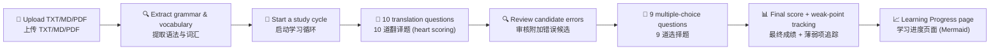

# Lingua Web

> 基于自定义日语材料与 AI 反馈的学习原型 · A Japanese Learning Web Prototype Powered by Custom Materials and AI Feedback  
> 通过 Phase 4 迭代开发 · Through Phase 4 iterative development

[简体中文](#简体中文) | [English](#english)

---



---

## 简体中文

### 项目简介

Lingua Web 是一个自用日语学习 Web 原型，历经四个迭代阶段，实现了从材料上传到智能学习循环、心脏评分、薄弱项溯源与学习进度展示的完整流程。用户上传 TXT、Markdown 或 PDF 格式的日语学习材料，系统自动提取语法点和词汇，引导用户完成翻译题 → 候选错误审核 → 选择题 → 最终成绩和进度展示的完整学习闭环。

### 当前已实现功能（Phase 1–4）

| 功能领域 | 状态 | 说明 |
|---------|:----:|------|
| **材料上传与提取** | ✅ | TXT/Markdown 通过 DeepSeek 提取语法点（含 JLPT 级别标注和原文示例）和词汇；PDF 通过 OpenAI gpt‑5.4‑mini 视觉理解提取，**仅发送用户指定的页码范围**，不超过 10 页。 |
| **多素材组合学习** | ✅ | 可勾选多个已有素材启动一次学习循环，语法点去重后适用已掌握过滤和弱项优先排序。 |
| **素材删除与归档** | ✅ | 未使用素材硬删除；有学习历史的素材隐藏但不影响历史追溯。 |
| **智能评分 v2 (Phase 4D)** | ✅ | 翻译题由 DeepSeek 评估后记录 `score_hearts`（0-10）和 `target_grammar_correct`（布尔值）。若 `target_grammar_correct=true` 且得分 ≥6 则通过；若 `target_grammar_correct=false` 且得分 ≤5 则自动记录目标语法薄弱点。矛盾评分（如 true+5 分）被拒绝且不产生副作用。 |
| **附加错误候选 (Phase 4A)** | ✅ | 翻译答案中的非目标语法错误（助词、词汇、变型等）作为候选显示，用户需在进入选择题前逐条确认 `add_to_weak_points` 或 `ignore`。相同错误规则合并出现次数，曾被忽略的错误再次出现时警告用户。 |
| **选择题判定** | ✅ | 由 Python 确定性判定，无 LLM 开销。 |
| **薄弱项溯源 (Phase 4B)** | ✅ | 每次薄弱点操作记录 `WeakPointEvent`，含来源（翻译低分/候选确认/选择题错误）和事件类型（`created`/`hit_existing`/`voided`）。`voided` 事件保留审计历史但不计入统计。 |
| **最终成绩公式** | ✅ | 翻译题贡献 = `score_hearts / 10 × 100`；选择题正确 = 100，错误 = 0。仅统计实际作答题目（跳过/已学过/预生成状态不计入分母）。仅在学习循环完成后显示最终综合成绩。 |
| **学习进度页面 (Phase 4C)** | ✅ | 当前进行中的循环以 Mermaid 流程图展示（Mermaid 从本地 `app/static/vendor/mermaid.min.js` 加载，无外部 CDN）；已完成循环的历史汇总显示薄弱点新建/重复命中次数。无溯源能力的旧循环标记为「不完整统计」。 |
| **会话恢复与模块操作** | ✅ | 未完成循环可中断后精确恢复；支持跳过（不计入有效完成、不计分母、不产生薄弱项）和标记已学过（标记为有效完成）。 |
| **已掌握标记** | ✅ | 可在素材详情页或学习过程中标记语法/词汇为已掌握；不影响历史成绩，后续循环不再选用。 |
| **成本追踪** | ✅ | 记录所有 DeepSeek 和 OpenAI API 调用的 token 用量并估算成本。 |

### 实际学习流程

1. 打开 `/materials` 页面上传 TXT、Markdown 或 PDF 格式的日语材料（PDF 使用 gpt‑5.4‑mini 视觉理解分析，仅选择希望学习的页码范围）
2. 系统自动调取 AI 提取语法点和词汇，于详情页展示；用户可将已掌握的语法/词汇标记为「已掌握」
3. 在素材列表点击「开始学习」，系统从**未掌握**的语法点中选取两个，并行生成语法解释和题目
4. **翻译题阶段**：逐题作答 10 道翻译题（每题 5 道，对应语法 A 和 B）。每道题后显示心脏评分（❤️×N）、修正答案和中日文反馈
5. **候选错误审核关卡**：如果存在附加错误候选，系统强制展示候选列表。用户需逐条选择 `add_to_weak_points` 或 `ignore`。如果曾被忽略的错误再次出现，系统发出警告。此关卡完成后才能进入选择题。
6. **选择题阶段**：逐题作答 9 道选择题（4 道辨析 + 5 道复习）
7. **循环完成**：所有题目完成后显示综合成绩（等权平均）、每题详情和薄弱点摘要
8. 打开 `/study/progress` 查看当前进度 Mermaid 流程图和历史循环汇总

### 翻译评分合约（Phase 4D）

| 条件 | 结果 |
|------|:----:|
| `target_grammar_correct = true` 且 `score_hearts` 在 **6..10** | ✅ **通过**，不产生目标语法薄弱点 |
| `target_grammar_correct = false` 且 `score_hearts` 在 **0..5** | ❌ **未通过**，自动创建/更新目标语法薄弱点 |
| `target_grammar_correct = true` 且 `score_hearts` ≤ 5 | ⛔ 矛盾输出，拒绝——不持久化、不产生薄弱点/事件/候选 |
| `target_grammar_correct = false` 且 `score_hearts` ≥ 6 | ⛔ 矛盾输出，拒绝——同上 |

最终成绩示例：两条翻译题得分 6 和 7（贡献 60% 和 70%），3 道选择题对 2 道（100/100/0），则最终成绩 = (60 + 70 + 100 + 100 + 0) / 5 = 66%。

### 薄弱点事件语义（WeakPointEvent）

| `event_type` | 含义 | 是否计入统计 |
|:-------------|:-----|:-----------:|
| `created` | 新建薄弱点 | ✅ 计入新建数 |
| `hit_existing` | 命中已有薄弱点 | ✅ 计入重复命中数 |
| `voided` | 事件经审核后确认无效 | ❌ 排除（保留审计历史） |

### 系统架构

```
用户浏览器 → FastAPI 服务 → SQLite 数据库
                  ↓
          DeepSeek API / OpenAI API
```

**边界划分：** DeepSeek 负责 TXT/MD 提取、学习循环生成/翻译评估；OpenAI gpt‑5.4‑mini 负责 PDF 视觉理解提取（仅用户指定页）；Python Runtime 与 SQLite 负责流程推进、已掌握过滤、判题写入、薄弱项更新、会话恢复、心脏评分持久化和进度展示。

### 技术栈

| 层次 | 技术 |
|------|------|
| 语言 | Python 3.11 |
| Web 框架 | FastAPI |
| 数据库 | SQLite + SQLAlchemy 2.x |
| 模板 | Jinja2（服务端渲染，无外部 CDN） |
| 包管理 | uv |
| AI | DeepSeek API（TXT/MD 提取、学习循环生成/评估） |
| AI | OpenAI gpt‑5.4‑mini（PDF 视觉理解提取） |
| 图表 | Mermaid（本地 vendor） |

### 数据模型 & 迁移说明

当前数据库 `data/lingua.db` 包含以下 Phase 4 新增的架构：

| 表/字段 | 用途 | 引入阶段 |
|---------|------|:--------:|
| `question_attempts.score_hearts` | 翻译题心脏评分（0-10） | Phase 4A |
| `question_attempts.target_grammar_correct` | 目标语法是否正确使用（布尔值） | Phase 4D |
| `translation_error_candidates` | 翻译题附加错误候选 | Phase 4A |
| `weak_point_events` | 薄弱点操作溯源事件记录 | Phase 4B |

新增字段通过开机时幂等迁移自动添加，不会破坏已有数据。旧翻译记录的 `score_hearts` 和 `target_grammar_correct` 保持 `NULL`。

### 本地配置

| 环境变量 | 说明 | 默认值 |
|----------|------|--------|
| `LINGUA_DATABASE_URL` | 学习数据库 URL | `sqlite:///./data/lingua.db` |
| `LINGUA_TESTING` | 设为 `1` 启用测试模式（拒绝连接真实数据库） | 空 |
| `DEEPSEEK_API_KEY` | DeepSeek API 密钥 | — |
| `OPENAI_API_KEY` | OpenAI API 密钥 | — |

测试使用隔离的临时 SQLite 数据库，与用户的 `data/lingua.db` 完全分离。
以 `cd /home/pompeo_z/workspace/lingua-web && uv run pytest tests/` 运行测试时自动设置 `LINGUA_TESTING=1` 和临时数据库路径。详细配置见 `app/config.py`。

### 本地运行

```bash
# 1. 进入项目目录
cd /home/pompeo_z/workspace/lingua-web

# 2. 同步依赖
uv sync

# 3. 配置 DeepSeek 环境变量（使用占位符替换真实密钥）
export DEEPSEEK_API_KEY="your_api_key_here"
export DEEPSEEK_BASE_URL="https://api.deepseek.com/v1"

# 4. 启动服务
uv run uvicorn app.main:app --host 0.0.0.0 --port 8000
```

打开 http://localhost:8000/materials

> ⚠️ **安全提醒：** 不要将真实 API Key 或包含密钥的 `.env` 文件提交到 Git。

### 路由表

| 路由 | 方法 | 用途 |
|------|------|------|
| `/` | GET | 重定向到素材列表 |
| `/materials` | GET | 素材列表（统一管理入口） |
| `/materials/{id}` | GET | 素材详情（语法 + 词汇展示） |
| `/materials/delete_selected` | POST | 批量删除素材 |
| `/study/start_cycle` | POST | 开始新学习循环 |
| `/study` | GET | 学习首页 / 恢复入口 |
| `/study/current` | GET | 当前未答题 |
| `/study/answer` | POST | 提交答案 |
| `/study/review_candidates` | GET | 附加错误候选审核页 |
| `/study/candidate/{id}/add` | POST | 确认候选为薄弱点 |
| `/study/candidate/{id}/ignore` | POST | 忽略候选 |
| `/study/progress` | GET | 学习进度 / 最终结果 |
| `/study/skip_module` | POST | 跳过当前模块 |
| `/study/mark_studied` | POST | 标记当前模块已学过 |
| `/weak_points` | GET | 薄弱项列表 |

### 测试状态

测试使用隔离的临时 SQLite 数据库。已验证通过的可靠测试子集：

| 套件 | 测试数 | 状态 |
|------|:------:|:----:|
| Phase 4D（心脏评分 v2） | 23 | ✅ 通过 |
| Phase 4A（心脏评分 v1 + 候选审核） | 26 | ✅ 通过 |
| Phase 4C（Mermaid 进度 + 历史汇总） | 27 | ✅ 通过 |
| 薄弱点溯源（WeakPointEvent） | 16 | ✅ 通过（含 voided 排除测试） |
| Phase 3（延迟生成 + 预取） | 8 | ✅ 通过 |
| Phase 2.1（素材归档/删除） | 13 | ✅ 单独运行时通过 |

> **已知测试债务：** Phase 1a / Phase 1b / Phase 2 包含继承的失败/错误测试（与真实数据库隔离、已掌握语义相关），Phase 4 基线对比证明未引入新回归。Phase 2.1 的单项测试 `test_deleted_unused_mistaken_material_does_not_leave_mastery_side_effect` 在组合运行时因 SQLAlchemy 身份映射隔离行为偶发失败（与 Phase 4 变更无关）。

### 已知限制

- 当前仅实现日语学习流程，尚未扩展到多语言
- 当前为单用户自用原型，不包含认证或账户隔离
- 尚未实现听力、音频与间隔重复
- 题目质量仍依赖 LLM 生成结果与当前校验策略
- 尚未进行生产部署与安全加固
- 9 条翻译附加错误候选（来自旧评分旧记录）仍处于 `pending` 状态，等待用户处理
- CLI 路径下 DeepSeek 可用性依赖正确的 `load_dotenv` 导入顺序

### 开发报告与提交记录

| 报告 | 对应提交 | 内容 |
|------|----------|------|
| [Day 1 报告](docs/reports/day1-material-ingestion-report.md) | `f5922b2` | 材料上传与提取流水线 |
| [Day 2 报告](docs/reports/day2-study-cycle-runtime-report.md) | `f5922b2` | 19 题学习循环运行时 |
| [Day 3 报告](docs/reports/day3-prototype-closure-report.md) | `f15c2ed` + `67680a6` | 薄弱项、恢复、成本测量 |
| [P2.1 报告](docs/reports/p2-1-gpt54-mini-pdf-vision-report.md) | `a1e27e3` | GPT-5.4-mini PDF 视觉解析 |
| [Phase 4A 报告](docs/reports/phase4a-translation-heart-scoring-implementation-report.md) | `4e9e5ea` | 心脏评分、候选审核、Review Gate |
| [Phase 4B/4C 报告](docs/reports/phase4bc-progress-and-material-navigation-implementation-report.md) | `48f708f` | Mermaid 进度页、薄弱点溯源 |
| [Phase 4D 报告](docs/reports/phase4d-target-grammar-aware-scoring-implementation-report.md) | `a68cd4b` | 目标语法感知评分 |
| [Phase 4D 闭合报告](docs/reports/phase4d-authorized-real-record-correction-report.md) | `497d092` | 旧记录修正 + voided 语义 |

提交链：`f5922b2` → `dcfdb41` → `f15c2ed` → `67680a6` → `7c7cd11` → `4e9e5ea` → `48f708f` → `a68cd4b` → `497d092`

---

## English

### Overview

Lingua Web is a self‑use Japanese learning web prototype that has evolved through four iteration phases (Phase 1–4). It covers the full pipeline from material upload (TXT, Markdown, PDF with Vision) to guided study cycles with heart‑based translation scoring, additional‑error candidate review, weak‑point provenance tracking, and a Mermaid‑based learning progress page.

### Feature Summary (Phase 1–4)

| Area | Status | Description |
|------|:------:|-------------|
| Material upload TXT/MD/PDF | ✅ | TXT/MD: DeepSeek extraction; PDF: gpt‑5.4‑mini Vision (≤10 pages) |
| Multi‑material study | ✅ | Select multiple materials for one combined cycle |
| Material delete/archive | ✅ | Hard‑delete unused; archive with history retained |
| Translation scoring v2 (Phase 4D) | ✅ | `target_grammar_correct` + `score_hearts` 0‑10. Pass ≥6 with tgc=true; auto weak‑point when tgc=false and ≤5. Contradictory pairs rejected. |
| Error candidate review gate (Phase 4A) | ✅ | Non‑target grammar errors shown as candidates for `add_to_weak_points`/`ignore` before choices. Repeated same error warns. |
| Choice grading | ✅ | Deterministic Python (no LLM) |
| Weak‑point provenance (Phase 4B) | ✅ | `WeakPointEvent` records every operation: `created`, `hit_existing`, `voided`. |
| Final score formula | ✅ | Translation = `score_hearts/10×100`; choice = 100/0. Average across answered questions only. |
| Progress page (Phase 4C) | ✅ | Mermaid flowchart (local vendor, no CDN) + historical summaries. Legacy cycles marked accordingly. |
| Session resume & module actions | ✅ | Resume, skip (invalid completion), mark studied (valid completion) |
| Mastered marking | ✅ | Flag grammar/vocab as mastered; excluded from future cycles, no score impact |
| Cost tracking | ✅ | Token usage records for all API calls |

### Learning Flow

1. Upload materials at `/materials` (TXT/MD/PDF)
2. AI extracts grammar points and vocabulary
3. Select materials → "Start Learning"
4. **Translation stage** (10 questions) — each scored with hearts and `target_grammar_correct`
5. **Candidate review gate** — process additional‑error candidates before proceeding
6. **Choice stage** (9 questions) — deterministic grading
7. **Cycle complete** — final score displayed (equal‑weight average)
8. Visit `/study/progress` for Mermaid flowchart + historical summaries

### Translation Scoring Contract (Phase 4D)

| Condition | Result |
|-----------|:------:|
| `tgc=true` + hearts **6‑10** | ✅ **Pass**, no target‑grammar weak point |
| `tgc=false` + hearts **0‑5** | ❌ **Fail**, auto weak point for target grammar |
| `tgc=true` + hearts ≤5 | ⛔ Rejected, no side effects |
| `tgc=false` + hearts ≥6 | ⛔ Rejected, no side effects |

### Weak‑Point Event Semantics

| `event_type` | Meaning | Counted in stats? |
|:-------------|:--------|:-----------------:|
| `created` | New weak point | ✅ yes |
| `hit_existing` | Repeat hit | ✅ yes |
| `voided` | Proven invalid later | ❌ excluded (audit history preserved) |

### Tech Stack

| Layer | Technology |
|-------|-----------|
| Language | Python 3.11 |
| Web Framework | FastAPI |
| Database | SQLite + SQLAlchemy 2.x |
| Templates | Jinja2 (no external CDN) |
| AI | DeepSeek API + OpenAI gpt‑5.4‑mini |
| Charts | Mermaid (local vendor) |

### Repository Structure

```
lingua-web/
├── app/
│   ├── main.py              # FastAPI entry point
│   ├── db.py                # SQLAlchemy engine + idempotent migrations
│   ├── models.py            # ORM models (materials, cycles, attempts, etc.)
│   ├── schemas.py           # Pydantic schemas
│   ├── llm.py               # DeepSeek adapter
│   ├── pdf_vision.py        # gpt‑5.4‑mini PDF vision extraction
│   ├── agents/
│   │   ├── extractor.py     # Grammar/vocab extraction
│   │   └── generator.py     # Cycle generation + translation evaluation
│   ├── routes/
│   │   ├── upload.py        # Material upload + display
│   │   └── study.py         # Study cycle runtime (heart scoring, review gate, progress)
│   ├── services/
│   │   └── material_parser.py
│   ├── static/vendor/       # Local Mermaid.js (no CDN)
│   └── templates/           # Jinja2 templates
├── tests/                    # Test suites per phase
├── docs/reports/             # Implementation reports
├── data/                     # SQLite database (git‑ignored)
├── pyproject.toml
└── README.md
```

### Test Status

Reliable verified subsets:
- Phase 4D (scoring v2): **23/23** ✅
- Phase 4A (heart scoring + review gate): **26/26** ✅
- Phase 4C (Mermaid progress): **27/27** ✅
- Weak‑point provenance: **16/16** ✅ (incl. voided exclusion)
- Phase 3 (lazy generation): **8/8** ✅
- Phase 2.1 (archive/delete): **13/13** ✅ (isolated run)

> **Known debt:** Phase 1a/1b/2 have inherited failures/errors (pre‑dating Phase 4). One Phase 2.1 test has a combined‑run identity‑map isolation issue unrelated to Phase 4 changes.

### Current Limitations

- Japanese only (single user prototype, no auth)
- No listening, audio, or SRS
- 根据已接受的修正报告，9 条翻译附加错误候选仍处于 pending 状态，等待用户处理
- CLI DeepSeek availability depends on correct `load_dotenv` import order
- Not production‑deployed

### Report & Commit Log

| Report | Commit | Content |
|--------|--------|---------|
| [Day 1](docs/reports/day1-material-ingestion-report.md) | `f5922b2` | Material upload & extraction |
| [Day 2](docs/reports/day2-study-cycle-runtime-report.md) | `f5922b2` | Study cycle runtime |
| [Day 3](docs/reports/day3-prototype-closure-report.md) | `f15c2ed`+`67680a6` | Weak points, resume, costs |
| [P2.1 PDF Vision](docs/reports/p2-1-gpt54-mini-pdf-vision-report.md) | `a1e27e3` | PDF Vision analysis |
| [Phase 4A](docs/reports/phase4a-translation-heart-scoring-implementation-report.md) | `4e9e5ea` | Heart scoring + review gate |
| [Phase 4B/4C](docs/reports/phase4bc-progress-and-material-navigation-implementation-report.md) | `48f708f` | Mermaid progress + provenance |
| [Phase 4D](docs/reports/phase4d-target-grammar-aware-scoring-implementation-report.md) | `a68cd4b` | Target‑grammar‑aware scoring |
| [Phase 4D closure](docs/reports/phase4d-authorized-real-record-correction-report.md) | `497d092` | Record correction + voided semantics |

Commit chain: `f5922b2` → `dcfdb41` → `f15c2ed` → `67680a6` → `7c7cd11` → `4e9e5ea` → `48f708f` → `a68cd4b` → `497d092`

---

## License / 许可证

A license has not yet been specified for this project. All rights reserved by the author until further notice.
