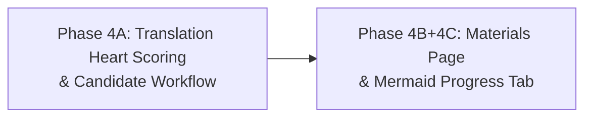

# Phase 4-0 Investigation Report — Translation Heart Scoring, Material Page Consolidation & Progress Tab Feasibility

**Phase:** 4-0 (Investigation only — no implementation)
**Project:** Lingua Web
**Report Date:** 2026-06-01
**Mode:** `investigation_only`
**Report Language:** Chinese

---

## 1. Actual Baseline and Phase 3 Closure Evidence

### Verification Commands (executed before investigation)

| Check | Command Output | Status |
|-------|---------------|--------|
| **git status --short** | Empty (clean working tree) | ✅ |
| **git rev-parse HEAD** | `7c7cd113d1d775b4ff7e4c679c3a38b9bdf94a5b` | ✅ |
| **git log -20** | `7c7cd11` feat: lazily generate study questions with prefetch | ✅ |

### Actual Baseline

The accepted post-Phase-3 baseline is **commit `7c7cd11`** with message `"feat: lazily generate study questions with prefetch"`. This is the HEAD and the working tree is clean.

### Phase 3 Closure Evidence (checked)

| Document | Status | Relevance |
|----------|--------|-----------|
| `docs/reports/phase2-1-final-closure-audit-report.md` | ✅ Present | Phase 2.1 deletion safety; commit `a1e27e3` + `4383f1a` |
| `docs/reports/day3-prototype-closure-report.md` | ✅ Present | Day 3 closure (weak points, resume, module operations) |
| `docs/reports/phase1a-test-db-isolation-and-skipped-semantics-report.md` | ✅ Present | Skipped semantics, test DB isolation |
| `docs/reports/phase1b-mastered-leakage-and-cancellation-report.md` | ✅ Present | Mastered leakage fix, `cancelled_mastered` |
| `tests/test_phase3.py` | ✅ Present | 8 tests for lazy generation + prefetch |
| Phase 3 specific report document | ❌ Not found | No standalone Phase 3 report exists; Phase 3 is the current HEAD |

### Phase 3 Changes (verified from code reading)

Phase 3 implemented lazy question generation with prefetch — 19 slots are created as `planned`, Q1 is generated synchronously, and subsequent questions are generated on demand via `POST /study/prefetch_next` or `_ensure_next_question_generated()`. Key changes visible at HEAD:

- `status` values extended: `planned`, `generating`, `generation_failed`
- `QuestionAttempt` got `target_grammar_id`, `generation_error`, `generation_started_at`
- `_generate_slot_content()` and `_ensure_next_question_generated()` functions
- Prefetch route at `POST /study/prefetch_next`

---

## 2. Scope and User-Locked Product Decisions

### All user-locked decisions recorded exactly as specified

| ID | Decision | Source |
|----|----------|--------|
| P4A-LOCK-001 | Each answered translation question receives score_hearts from 0 through 10 | implementation spec |
| P4A-LOCK-002 | score_hearts >= 8 means passed | implementation spec |
| P4A-LOCK-003 | score_hearts <= 7 means not passed | implementation spec |
| P4A-LOCK-004 | score_hearts <= 7 automatically creates/updates weak point for target grammar | implementation spec |
| P4A-LOCK-005 | Failed target grammar must NOT also be created as a pending additional-error candidate | implementation spec |
| P4A-LOCK-006 | Additional detected errors must not automatically become weak points | implementation spec |
| P4A-LOCK-007 | Additional-error candidates displayed only after both grammar modules (10 translation questions) complete | implementation spec |
| P4A-LOCK-008 | Candidate review must not interrupt individual translation or grammar A→B transition | implementation spec |
| P4A-LOCK-009 | Candidates stored and displayed per concrete error | implementation spec |
| P4A-LOCK-010 | Identical error_rule_key within the same review batch merged with occurrence_count | implementation spec |
| P4A-LOCK-011 | User must process every candidate (add or ignore) before entering choice module | implementation spec |
| P4A-LOCK-012 | No deferred/ later-review button; all candidates resolved in current flow | implementation spec |
| P4A-LOCK-013 | Ignored candidates remain as history with status=ignored (not soft-deleted) | implementation spec |
| P4A-LOCK-014 | Similar historical errors matched by concrete error_rule_key, not by sentence or broad category | implementation spec |
| P4A-LOCK-015 | Same particle-collocation error across different sentences = same error_rule_key | implementation spec |
| P4A-LOCK-016 | Error_rule_key with prior ignored history shows recurrence warning in candidate UI | implementation spec |
| P4A-LOCK-017 | Low score does not require immediate retry; question advances normally | implementation spec |
| P4A-LOCK-018 | First successful grading result is final; no retry-until-pass | implementation spec |
| P4A-LOCK-019 | Cycle final score uses per-question equal weighting across scored translation and choice questions | implementation spec |
| P4A-LOCK-020 | score_percent per question: translation = score_hearts/10*100, choice correct=100/wrong=0; final = sum / count(scored) | implementation spec |
| P4A-LOCK-021 | 7-heart translation contributes 70% to final score even though marked not passed | implementation spec |
| P4A-LOCK-022 | Do not display aggregate cycle score during learning; show per-question heart only; show final score at cycle completion | implementation spec |
| P4A-LOCK-023 | Historical score_hearts NULL attempts display legacy binary result; no backfill | implementation spec |
| P4A-LOCK-024 | Wrong choice answers preserve existing automatic weak-point behavior | implementation spec |
| P4A-LOCK-025 | skipped remains unscored, excluded, no weak points, no candidates | implementation spec |
| P4A-LOCK-026 | cancelled_mastered remains unscored, excluded, no weak points, no candidates | implementation spec |
| P4A-LOCK-027 | studied semantics unchanged | implementation spec |
| P4A-LOCK-028 | planned/generating/generation_failed remain unscored, excluded, no weak points, no candidates | implementation spec |
| P4A-LOCK-029 | Generation/grading failure creates no score, no weak point, no candidate | implementation spec |
| P4C-LOCK-001 | Mermaid must be loaded from locally vendored static file, not from external CDN | task spec |
| P4C-LOCK-002 | Planned vendor path: `app/static/vendor/mermaid.min.js` | task spec |
| P4C-LOCK-003 | Recommended version to confirm: Mermaid v10.x | task spec |
| P4C-LOCK-004 | Initialization: `mermaid.initialize({ startOnLoad: true, securityLevel: 'strict' })` | task spec |
| P4C-LOCK-005 | Downloading/adding vendor file deferred to Phase 4B/4C implementation | task spec |

### Phase 4A Semantics Matrix (revised product decision)

| Scenario | score_hearts | Target grammar weak point | Additional candidates |
|----------|:------------:|:------------------------:|:--------------------:|
| Answered translation, score_hearts ≥ 8, no additional issue | 8-10 | None | None |
| Answered translation, score_hearts ≥ 8, additional issue detected | 8-10 | None | Pending candidates for user review (each additional issue) |
| Answered translation, score_hearts ≤ 7 | 0-7 | **Automatic insertion** | Pending candidates only for additional issues; target grammar NOT duplicated as candidate |
| Wrong choice answer | N/A | Automatic (existing behavior) | Out of scope for Phase 4A |
| Skipped / cancelled_mastered / planned / generating / generation_failed / LLM grading failure | NULL | None | None |

### Invariants Preserved (confirmed)

| Status | Scoring | Weak Points | Denominator |
|--------|---------|-------------|-------------|
| **skipped** | Unscored | No | Excluded |
| **cancelled_mastered** | Unscored | No | Excluded, valid completion |
| **studied** | Unscored | No | Excluded, valid completion |
| **planned** | Never scored | No | Excluded |
| **generating** | Never scored | No | Excluded |
| **generation_failed** | Never scored | No | Excluded |

---

## 3. Confirmed / Inferred / Unknown Findings

### Confirmed (verified by reading source code)

1. **Translation grading uses LLM `evaluate_translation_answer()`**. Study.py:962-997 constructs a `TranslationExercise` from the question payload, calls `evaluate_translation_answer()`, and gets back a `TranslationEvaluation` with a binary `is_correct`.
2. **Current translation scoring is binary**. `TranslationEvaluation.is_correct` is a `bool`. The result is stored as `question_attempts.is_correct` boolean.
3. **Weak points are currently created unconditionally for ALL wrong answers**. Study.py:1021-1024 — after both translation AND MC, if `grammar_point_name` is non-empty and `is_correct` is False, `_record_weak_point(db, grammar_point_name)` is called.
4. **`_record_weak_point()` only records target grammar**. Study.py:151-177 — the function only records a WeakPoint with `point_type="grammar"` and `point_reference=grammar_point_name`. It does NOT extract or record additional particle/vocabulary errors from translation.
5. **The LLM grading prompt already evaluates particle, conjugation, vocabulary, and expression quality** via `TranslationEvaluation.feedback_zh` and `reason_zh`, but this data is used only for display in `_build_answer_feedback_html()`.
6. **`question_attempts` is the current table for translation answers**. No separate attempt/result model exists.
7. **`is_correct` boolean drives accuracy**: `_compute_cycle_completion()` counts `is_correct == True` for answered questions.
8. **No `translation_error_candidates` table exists**. There is no mechanism for pending error candidate review.
9. **`score_hearts` field does not exist** in any table.
10. **Choice questions are judged by Python** (`normalized == expected`), not by LLM. Study.py:998-1019.
11. **Material list route**: `GET /materials` → `materials.html` template.
12. **Upload route**: `POST /materials/upload` → redirects to detail page (no standalone upload route separate from list page).
13. **Navigation base template**: `app/templates/base.html` — contains nav links to: 素材列表, 上传素材, 薄弱点, 学习.
14. **No `static/vendor/` directory exists** — `app/static/` exists but is empty.
15. **No HTMX or external CDN**: Confirmed absent.
16. **Study progress route**: `GET /study/progress` → renders `study_result.html` with cycle stats.

### Inferred from code patterns (high confidence)

1. **LLM's `evaluate_translation_answer()` could produce richer output than binary** — the `TranslationEvaluation` schema already has `feedback_zh` and `reason_zh` fields that contain detailed evaluation. These could be leveraged to extract error categories.
2. **Translation error details are not stored in the DB** after the answer — only `is_correct` and the corrected answer. The LLM's `feedback_zh` and `reason_zh` are ephemeral, rendered into HTML in the HTTP response and never persisted.
3. **The weak-point code path is shared** — the same `_record_weak_point()` call at line 1024 serves both translation and MC. For Phase 4A, translation module answers score_hearts ≤ 7 will KEEP the automatic weak-point path for the target grammar (P4A-LOCK-001-REVISED), so `_record_weak_point()` for target grammar continues to fire; the new addition is adding error candidates for additional issues. MC keeps existing behavior unchanged.
4. **Historical data compatibility** — existing `question_attempts` rows with `is_correct` boolean for translation will still work, but the new `score_hearts` would be NULL for historical rows.

### Unknown (requires user decision or deeper investigation)

1. **Exact LLM response format for richer scoring** — The current `TranslationEvaluation` schema only has `is_correct: bool`. A new schema or extended schema with heart score (0-10) would be needed. The LLM prompt and response model must be updated.
2. **Where to add `score_hearts` field** — Confirmed it goes on `question_attempts`, but the exact migration approach and whether to keep `is_correct` temporarily is open (see OPEN-005/OPEN-006).
3. **Error category extraction reliability** — Whether the LLM can reliably extract distinct error categories (particle, vocabulary, conjugation, expression) from translation answers is unvalidated without real test data.
4. **Pending candidate review UI** — No existing UI or route for this workflow exists; it will be entirely new.

---

## 4. Phase 4A Existing Translation Grading Flow

### Complete Data Flow

```
User submits translation answer
  → POST /study/answer (study.py:936-1074)
    → module_type in ("grammar_a_translation", "grammar_b_translation")
    → Construct TranslationExercise from question_payload_json
      → payload.prompt_zh, payload.reference_answer_ja, payload.grammar_point, payload.grading_notes
    → evaluate_translation_answer(exercise, answer) (generator.py:334-365)
      → structured_extraction(EVALUATION_SYSTEM_PROMPT, user_prompt, TranslationEvaluation)
        → DeepSeek API call
        → Returns TranslationEvaluation(is_correct, feedback_zh, corrected_answer_ja, reason_zh)
        → Returns None on failure
    → If evaluation is None: HTTP error page with "评分失败，请重试"
    → If evaluation succeeds:
      → current_q.user_answer = answer
      → current_q.is_correct = evaluation.is_correct (bool)
      → current_q.answered_at = now
      → current_q.status = "answered"
      → current_q.correct_answer = evaluation.corrected_answer_ja
      → db.commit()
      → Build feedback_html from is_correct, corrected_answer, answer, feedback_zh
    → RECORD WEAK POINT (lines 1021-1024): if not is_correct AND grammar_point_name:
      → _record_weak_point(db, grammar_point_name) → creates/increments WeakPoint
    → Advance session state to next question
    → _ensure_next_question_generated() for lazy prefetch
    → Render feedback HTML with "下一题" link
```

### Key Code Locations

| Step | File | Lines |
|------|------|-------|
| Translation answer handler | `app/routes/study.py` | 962-997 |
| LLM evaluation call | `app/agents/generator.py` | 334-365 |
| Evaluation schema | `app/schemas.py` | 91-98 (TranslationEvaluation) |
| Exercise schema | `app/schemas.py` | 65-73 (TranslationExercise) |
| LLM adapter | `app/llm.py` | 59-135 (structured_extraction) |
| Weak point recording | `app/routes/study.py` | 151-177 (_record_weak_point) |
| Weak point trigger | `app/routes/study.py` | 1021-1024 |
| Feedback HTML builder | `app/routes/study.py` | 457-472 |
| Cycle completion (accuracy) | `app/routes/study.py` | 99-148 |
| Current question rendering | `app/routes/study.py` | 769-929 |
| Result page template | `app/templates/study_result.html` | 1-94 |
| In-session question template | `app/templates/study.html` | 1-99 |

### Existing Grading Prompt (EVALUATION_SYSTEM_PROMPT)

Located at `generator.py:70-83`:
```
You are a Japanese language grading assistant.
Given a translation exercise and a user's Japanese answer, evaluate:
1. is_correct: Is the answer semantically acceptable? Does it correctly use the target grammar?
2. feedback_zh: Constructive feedback in Chinese
3. corrected_answer_ja: A corrected version of the user's Japanese answer
4. reason_zh: Brief reason for the score in Chinese

RULES:
- Evaluate based on the grading_notes provided.
- Do NOT require exact match with the reference answer.
- Any answer that conveys the meaning and uses the target grammar acceptably passes.
- Minor particle/vocabulary errors that don't affect meaning should still pass.
- Return valid JSON matching the requested schema. No extra text.
```

---

## 5. Phase 4A Existing Weak-Point Creation Flow

### Current Behavior

The weak-point creation happens at **study.py:1021-1024**:
```python
grammar_point_name = payload.get("grammar_point", "")
if grammar_point_name and not is_correct:
    _record_weak_point(db, grammar_point_name)
```

This code is AFTER the translation-or-MC branching — it runs for BOTH types equally. There is no `module_type` check.

### `_record_weak_point()` (study.py:151-177)

```python
def _record_weak_point(db, grammar_point_name):
    wp = db.query(WeakPoint).filter(
        WeakPoint.point_type == "grammar",
        WeakPoint.point_reference == grammar_point_name,
    ).first()
    if wp:
        wp.error_count += 1
        wp.last_error_at = now
        if wp.error_count >= 2:
            wp.is_active = True
    else:
        wp = WeakPoint(point_type="grammar", point_reference=grammar_point_name,
                        error_count=1, last_error_at=now, is_active=False)
        db.add(wp)
    db.commit()
```

### What Currently Gets Recorded

| Field | Value | Comment |
|-------|-------|---------|
| `point_type` | `"grammar"` | Hardcoded |
| `point_reference` | `payload.get("grammar_point")` | The target grammar name |
| `error_count` | incremented by 1 | Auto-increment |
| `last_error_at` | now | |
| `is_active` | True if `error_count >= 2` | |

### What is NOT Currently Recorded

- ❌ Additional particle errors discovered by LLM
- ❌ Vocabulary errors
- ❌ Conjugation errors
- ❌ Expression quality issues
- ❌ Any non-target-grammar mistakes
- ❌ No per-attempt error detail

### Future Code Change for Phase 4A

The weak-point logic at study.py:1021-1024 needs the following changes (study.py:1021-1024 is the shared trigger point):

1. **Translation modules**: Keep the auto weak-point path for **target grammar** when score_hearts ≤ 7. The existing `_record_weak_point(db, grammar_point_name)` call continues to fire for the target grammar — no change needed for this part.
2. **Additional candidate extraction (NEW)**: After the LLM evaluation returns score_hearts + error details, extract additional detected issues (particle, vocabulary, conjugation, expression errors) and insert them as `translation_error_candidates` rows with `status='pending'`. These are NOT auto-recorded as weak points.
3. **MC questions**: Behavior unchanged — automatic weak-point creation via `_record_weak_point()` still fires.

Note: The `_record_weak_point()` function can be **reused** for the `add_to_weak_points` action when converting a pending candidate to an active weak point. The function signature accepts `grammar_point_name` and handles deduplication correctly.

---

## 6. Phase 4A Statistics, Completion, and Historical Compatibility Impact

### Current Statistics

`_compute_cycle_completion()` (study.py:99-148):

| Metric | Formula | Source |
|--------|---------|--------|
| `total` | `len(all_qs)` | All questions |
| `answered` | count of `status == "answered"` | Status field |
| `correct` | count of `is_correct == True` | Boolean field |
| `accuracy` | `correct / answered * 100` | Only answered count |
| `skipped` | count of `status == "skipped"` | Status field |
| `studied` | count of `status == "studied"` | Status field |
| `cancelled_mastered` | count of `status == "cancelled_mastered"` | Status field |
| `pending` | count of `status in (pending, planned, generating, generation_failed)` | Status field |

### Impact of Heart Scoring

| Aspect | Current | After Phase 4A | Compatibility |
|--------|---------|----------------|---------------|
| Translation `is_correct` | Boolean, used in `correct` count | Needs `score_hearts >= 8` → `is_correct = True` (or a new pass/fail field) | **Backward-compatible**: can derive `is_correct` from `score_hearts` |
| Translation display in result | ✅/❌ via `is_correct` | Hearts display (e.g., `❤️❤️❤️❤️❤️❤️❤️❤️🤍🤍`) | Mixed display: new sessions show hearts, historical show ✅/❌ |
| Accuracy calculation | `correct / answered * 100` | Translation accuracy could stay as `is_correct` derived from heart score (≥8 = correct) | **No change needed** — derivation from `score_hearts` |
|| Weak-point count | All wrong answers (target grammar) | Translation wrong answers: target grammar STILL auto-creates weak points; additional issues do NOT auto-create | Target grammar path unchanged; additional-issue path is new |
| Cycle completion | Uses status, not correctness | Unchanged — `answered` status still counts regardless of heart score | **No change needed** |
| Module completion | All questions non-pending | Unchanged | **No change needed** |

### Historical Attempt Compatibility

| Option | Description | Advantage | Risk |
|--------|-------------|-----------|------|
| **Option A: Backfill** | Historical correct translations → `score_hearts = 10`, wrong → `score_hearts = 0` | Uniform UI heart display | Creates artificial precision not present in historical grading (a borderline-correct historical answer gets 10, but a modern borderline answer might get 7) |
| **Option B: NULL (Recommended)** | Keep existing historical `score_hearts = NULL`; display legacy ✅/❌ for old, hearts for new | Honest about data quality; no invented precision | Mixed old/new display in result page |

**Recommendation**: Option B — keep NULL for historical rows. The mixed display is a minor UI concern (template needs an `if score_hearts is not None` branch) and avoids misleading the user with artificial precision. See OPEN-005 for final product decision.

---

## 7. Phase 4A Recommended Schema: score_hearts

### Recommended Field

```
Table: question_attempts
Field: score_hearts  INTEGER  NULLABLE
Constraint: NULL, or integer between 0 and 10 inclusive
```

### Rationale

- **NULL** = unscored or historical or preparation attempt (`planned`, `generating`, `generation_failed`, `skipped`, `studied`, `cancelled_mastered`, or pre-Phase-4A answered rows)
- **0-10** = scored translation attempt (answered)
- **score_hearts >= 8** → passes
- **score_hearts <= 7** → not passed, generates error candidates

### Why `question_attempts` and not a separate model

- The `question_attempts` table already holds per-attempt data
- `is_correct` exists here and `score_hearts` is a natural extension
- No separate attempt/result model exists; creating one would add complexity without benefit
- Adding a nullable column is a safe migration via `_add_column_if_missing()`

### Must `is_correct` remain temporarily?

**Yes** — for compatibility:
- `_compute_cycle_completion()` counts `is_correct` for accuracy. While this could be changed to `score_hearts >= 8`, keeping `is_correct` during the transition allows:
  - Historical rows to remain valid (they have `is_correct` but NULL `score_hearts`)
  - The code path that derives `is_correct` from `score_hearts` to be verified before removing the old field
- MC questions will never have `score_hearts` (P4A-LOCK-004: MC remains binary Python judgment), so `is_correct` is still needed for MC

**Phased removal**: `is_correct` can be deprecated after Phase 4A stabilizes, replaced by:
- For translation: `score_hearts >= 8`
- For MC: a new `is_correct` computed from existing MCQ deterministic logic (or keep `is_correct` for MC)

### Migration

Add via `app/db.py:_add_column_if_missing("question_attempts", "score_hearts", "INTEGER")`. Safe, idempotent, no data loss.

---

## 8. Phase 4A Recommended Schema: translation_error_candidates

### Proposed Minimal Schema

```sql
CREATE TABLE translation_error_candidates (
    id                  INTEGER PRIMARY KEY AUTOINCREMENT,
    cycle_id            INTEGER NOT NULL,
    source_attempt_id   INTEGER NOT NULL REFERENCES question_attempts(id),
    error_type          VARCHAR(50) NOT NULL,
    description         TEXT NOT NULL,
    suggested_grammar_point_id  INTEGER NULL REFERENCES grammar_points(id),
    target_grammar_id   INTEGER NULL REFERENCES grammar_points(id),
    status              VARCHAR(20) NOT NULL DEFAULT 'pending',
    created_at          DATETIME NOT NULL,
    decided_at          DATETIME NULL,
    
    CHECK (status IN ('pending', 'added', 'ignored'))
);
```

### Rationale

| Field | Purpose |
|-------|---------|
| `cycle_id` | Group candidates by cycle for batch review |
| `source_attempt_id` | Trace back to the original translation answer |
| `error_type` | `"particle"`, `"vocabulary"`, `"conjugation"`, `"expression"`, `"other"` — DOES NOT include `"target_grammar"` because target grammar is auto-recorded via existing weak-point path (P4A-LOCK-001-REVISED) |
|| `description` | Human-readable description of the error (from LLM feedback) |
|| `suggested_grammar_point_id` | FK to grammar_points if the error relates to a known grammar point (nullable) |
|| `target_grammar_id` | FK to the cycle's target grammar — used for traceability only, NOT for candidate display (P4A-LOCK-002-REVISED) |
|| `status` | `pending` → awaiting user decision, `added` → user confirmed to weak points, `ignored` → user dismissed |
| `created_at` | When the candidate was generated |
| `decided_at` | When the user made a decision |

### Key Design Decisions

1. **Candidate text snapshots**: The `description` field serves as the human-readable error snapshot. No separate `original_answer_snapshot` or `corrected_answer_snapshot` fields are needed because `source_attempt_id` links back to `question_attempts.user_answer` and `question_attempts.correct_answer` (which stores the corrected answer). The link provides full traceability.

2. **Uniqueness and deduplication**: No schema-level uniqueness constraint. Deduplication logic (if desired) belongs in the application layer:
   - Same `source_attempt_id` + same `error_type` + same `description` → duplicate candidate
   - Cross-attempt deduplication is an open product decision (OPEN-003)

3. **Reusing existing weak-point code**: The `add_to_weak_points` action for additional-issue candidates can directly call `_record_weak_point(db, description_or_grammar_name)` when the candidate's status is changed from `pending` to `added`, since `_record_weak_point()` already handles deduplication and increment logic by `point_type + point_reference`. For grammar-type candidates, `point_reference` would be the grammar name; for other error types, a convention like `error_type:description` could be used.
4. **Target grammar is NOT stored as a candidate**: Because the target grammar is automatically added to weak points via the existing path (P4A-LOCK-001-REVISED), there is no need to create a `translation_error_candidates` row for it. The `target_grammar_id` field in the candidate table is for traceability only, not for constructing a target-grammar candidate.

### Migration

Add in `app/db.py:_add_column_if_missing()` is insufficient for a new table. Must add a `Base.metadata` model class and re-run `init_db()`. This is safe — `create_all` is idempotent for new tables.

---

## 9. Phase 4A Required Semantic Changes and Preserved Invariants

### Semantic Changes Required

| # | Current | After Phase 4A | Code Change |
|---|---------|----------------|-------------|
| 1 | Translation grading returns binary `is_correct` | LLM returns `score_hearts` (0-10) + error details for additional-issue extraction | New/Extended `TranslationEvaluation` schema |
| 2 | Wrong translation → auto-weak-point for target grammar (only) | Wrong translation (≤7 hearts) → auto-weak-point for target grammar STAYS; additional issues become pending candidates | Add candidate insertion after existing weak-point path; no weak-point path removal for target grammar |
| 3 | Translation feedback shows ✅/❌ | Feedback shows `score_hearts/10` hearts | Template + feedback builder update |
| 4 | No candidate review flow | New route: review only additional-issue candidates, add_to_weak_points, ignore | New route + template |
| 5 | No additional-error tracking | Additional errors extracted from LLM evaluation become `translation_error_candidates` rows; user decides per candidate | New candidate insertion path, no removal of existing auto weak-point path for target grammar |

### Preserved Invariants

| Invariant | Guarantee |
|-----------|-----------|
| **Skipped** unscored, no weak points, excluded from accuracy | Unchanged |
| **Cancelled_mastered** unscored, no weak points, valid completion | Unchanged |
| **Studied** unscored, no weak points, valid completion | Unchanged |
| **planned/generating/generation_failed** never scored | Unchanged (P4A-LOCK-005) |
| Generation failure never produces score_hearts or candidates | Unchanged (P4A-LOCK-005) |
|| Wrong MC questions auto-create weak points | Unchanged (P4A-LOCK-004-UNCHANGED) |
|| Failed translation auto-creates target grammar weak point | Preserved by revised decision (P4A-LOCK-001-REVISED) |
|| Additional translation issues never auto-create weak points | Enforced by revised decision (P4A-LOCK-003-REVISED) |
| Accuracy uses `answered` count only | Unchanged |
| Cycle completion uses status, not correctness | Unchanged |
| `is_correct` still works for MC and historical | Unchanged during transition |

---

## 10. LOCKED_PRODUCT_DECISIONS (previously OPEN — all finalized)

All open product decisions from Phase 4-0 investigation have been locked by the user for Phase 4A implementation. Below is the final locked state:

| ID | Topic | Locked Decision | Blocked 4A? |
|----|-------|----------------|:-----------:|
| P4A-LOCK-007 | Error candidate display timing | After both grammar modules (all 10 translation questions) complete | No |
| P4A-LOCK-009 | Candidate granularity | One candidate per concrete detected error (target grammar excluded) | No |
| P4A-LOCK-010 | Cross-question deduplication | Identical error_rule_key merged with occurrence_count within same batch | No |
| P4A-LOCK-013 | Ignored candidate retention | Retain with status=ignored in DB for audit history | No |
| P4A-LOCK-023 | Historical heart migration | Keep historical score_hearts NULL; no backfill | No |
| P4A-LOCK-017 | Low heart score effect on completion | Completed-answer semantics: question advances regardless of score | No |

| | **open_decisions_count** | 0 (all locked) |
| | **blocking_decisions_count** | 0 |
| | **recommended_next_action** | Phase 4A implementation is ready to proceed — all decisions locked. |
---

## 11. Phase 4B Lightweight Material Page Function Matrix

### Current Routes

| Route | Method | Template | Purpose |
|-------|--------|----------|---------|
| `GET /materials` | GET | `materials.html` | Material list + inline upload form (initial state) or upload link |
| `GET /materials?show_upload=1` | GET | `materials.html` (with upload form) | Same page, upload form expanded |
| `GET /materials/{material_id}` | GET | `material_detail.html` | Single material detail with grammar/vocab lists |
| `POST /materials/upload` | POST | Redirects to `/materials/{id}` | File upload + extraction |

### Current Upload Entry Points

The upload functionality is **already on the material list page** (`materials.html`):
- When materials list is empty: upload form shown directly in the page
- When materials exist: an upload button (+ 上传新素材) link to `?show_upload=1` which shows the upload form on the same page
- The upload form supports TXT, MD, and PDF with page range for PDF

There is **no separate standalone upload route** with its own template. The upload form is embedded in `materials.html`.

### Function Matrix

| Feature | Available? | Where | Notes |
|---------|:----------:|-------|-------|
| TXT upload | ✅ | `materials.html` upload form → `POST /materials/upload` | Via `parse_uploaded_material` |
| MD upload | ✅ | Same form as TXT | `.md` extension handled identically to TXT |
| PDF upload | ✅ | Same form with page range inputs | Via OpenAI PDF Vision (gpt-5.4-mini) |
| PDF selected-page extraction | ✅ | PDF upload with `start_page`/`end_page` | Max 10 pages |
| Multi-material study start | ✅ | `materials.html` checkboxes → `POST /study/start_cycle` | Supports `material_ids` array |
| Single-material study start | ✅ | Per-material "开始学习" button | Uses `material_id` parameter |
| Hard delete (unused) | ✅ | `POST /materials/delete_selected` | Checks cycle_materials + grammar references |
| Archive (used) | ✅ | Same delete endpoint | Sets `archived_at` |
| Material detail navigation | ✅ | `GET /materials/{id}` | Shows grammar points + vocab |

### Files to Modify for Phase 4B (future)

| File | Expected Change |
|------|-----------------|
| `app/routes/upload.py` | Route consolidation (if `GET /upload` redirects or merges) |
| `app/templates/materials.html` | UI adjustments for unified page |
| `app/templates/base.html` | Nav link updates if routes change |
| `app/main.py` | (Possibly) route reordering or redirect |

### Identified Blockers

**None.** The material list page already contains upload functionality. The "unified page" requirement is essentially already satisfied — the upload form lives on the materials page. The task of Phase 4B may be as simple as ensuring the `/materials?show_upload=1` UX is smooth and removing any redundant upload entry points.

---

## 12. Phase 4C Lightweight Progress Tab and Local Mermaid Vendor Confirmation

### Current Navigation (base.html)

| Nav Entry | Link | Purpose |
|-----------|------|---------|
| Lingua Web (brand) | `/` (redirects to `/materials`) | Home |
| 素材列表 | `/materials` | Material management |
| 上传素材 | `/materials?show_upload=1` | Upload (on same page) |
| 薄弱点 | `/weak_points` | Weak point list |
| 学习 | `/study` | Study entry/resume |

A "学习进度" (Learning Progress) tab would be added as a new nav entry.

### Study-State Query Points (for read-only progress rendering)

| Query | Returns | Location |
|-------|---------|----------|
| `SessionState.current_cycle_id` | Current cycle or None | `app/models.py:123-125` |
| `StudyCycle` by id | Grammar A/B, completed_at, is_valid_completion | `app/models.py:73-82` |
| `QuestionAttempt` by cycle_id | All question statuses, is_correct, score_hearts (future) | `app/models.py:84-101` |
| `_compute_cycle_completion()` | Stats dict | `app/routes/study.py:99-148` |
| `WeakPoint` all | Active/inactive weak points | `app/models.py:107-115` |

These are **all existing** and suitable for read-only progress rendering.

### Mermaid Vendor Path

- **Planned path**: `app/static/vendor/mermaid.min.js`
- **Current state**: `app/static/` exists but is empty; `app/static/vendor/` does not exist
- **Recommended version**: Mermaid **v10.9.x** (latest v10.x stable) — MIT licensed
  - v10.x confirmed compatible with `startOnLoad: true` and `securityLevel: 'strict'`
  - v11+ changes initialization API; stay within v10.x as user-locked
- **License compatibility**: MIT — compatible with this project's license

### Future Progress Statuses to Represent in Mermaid Flowchart

| Status | Mermaid Representation |
|--------|----------------------|
| answered / completed | ✅ Completed (green) |
| current / pending | 🔄 In progress (blue) |
| planned | ⏳ Planned (gray) |
| generating | ⏳ Generating (yellow) |
| generation_failed | ❌ Failed (red) |
| skipped | ⏭️ Skipped (orange) |
| studied | 📖 Known (green outline) |
| cancelled_mastered | ✅ Mastered (green outline) |

### Files to Modify for Phase 4B/4C (future)

| File | Expected Change |
|------|-----------------|
| `app/main.py` | New `GET /study/progress_diagram` or `GET /progress` route |
| `app/routes/study.py` | (Or a new routes file for progress diagram) |
| `app/templates/base.html` | Add "学习进度" nav link |
| `app/templates/progress.html` | New template with Mermaid diagram |
| `app/static/vendor/mermaid.min.js` | Download from MIT-licensed Mermaid v10.x |
| `app/static/css/` or inline `<style>` | Styling for progress page |

### Identified Blockers

**None.** All study state query points exist. The progress tab is a purely additive UI layer. No existing functionality needs to change.

---

## 13. Recommended Implementation Order



1. **Phase 4A first** (high risk, core scoring semantics change)
   - Schema migration: `score_hearts` on `question_attempts`, `translation_error_candidates` table
   - Updated LLM evaluation prompt: 0-10 heart score + error details
   - Code change: extend LLM evaluation to return score_hearts (0-10) + additional-error categories
   - Code change: auto-record target grammar weak point for score_hearts ≤ 7 (existing path preserved)
   - Code change: insert additional-error candidates (not auto weak points)
   - New route: candidate review for additional issues with add_to_weak_points / ignore
   - New route: candidate review with add_to_weak_points / ignore
   - UI: heart display on study.html and study_result.html

2. **Phase 4B + 4C together** (low-to-medium risk, UI-layer changes only)
   - No scoring semantics changes
   - Material page route consolidation
   - Progress tab with Mermaid vendor
   - These can be implemented together because both are primarily page-layer changes

---

## 14. Expected Files to Modify Per Future Phase

### Phase 4A

| File | Expected Change | Risk |
|------|-----------------|:----:|
| `app/models.py` | Add `TranslationErrorCandidate` model class; add `score_hearts` field to `QuestionAttempt` | Medium |
| `app/db.py` | Add `_add_column_if_missing` for `score_hearts` on `question_attempts`; new table creation via model | Low |
| `app/schemas.py` | Extend/New `TranslationEvaluation` with `score_hearts: int`, `error_candidates: list` | Low |
| `app/agents/generator.py` | New evaluation prompt for heart scoring + error extraction | Medium |
| `app/routes/study.py` | Guard weak-point creation (line 1021-1024) by module_type; add candidate generation after translation grading; new candidate review route(s) | **High** |
| `app/main.py` or new route file | `GET /study/candidates` — candidate review page | Low |
| `app/templates/study.html` | Show `score_hearts/10` hearts instead of or alongside ✅/❌ in translation feedback | Low |
| `app/templates/study_result.html` | Show hearts in result details; mixed old/new display (if Option B for historical) | Low |
| `app/templates/candidates.html` (new) | Candidate review page with add_to_weak_points / ignore buttons | Low |
| `app/templates/base.html` | (Possibly) add nav link to candidate review | Low |
| `tests/test_phase4a.py` (new) | 13+ tests (see §15) | Medium |

### Phase 4B + 4C (combined)

| File | Expected Change | Risk |
|------|-----------------|:----:|
| `app/main.py` | New progress diagram route | Low |
| `app/templates/base.html` | Add "学习进度" nav link | Low |
| `app/templates/progress.html` (new) | Mermaid progress flowchart | Low |
| `app/static/vendor/mermaid.min.js` | Download MIT-licensed v10.x | Low |
| `app/routes/upload.py` | (Possibly) route consolidation | Low |
| `app/templates/materials.html` | (Minimal) UI cleanup | Low |
| `tests/test_phase4bc.py` (new) | 5+ tests (see §15) | Low |

---

## 15. Required Regression Tests Per Future Phase

### Phase 4A Tests

| # | Test Purpose | Type |
|--:|--------------|------|
| 1 | Heart score parses and persists only for answered translation attempts | Unit |
| 2 | `score_hearts >= 8` displays as passed | Integration |
| 3 | `score_hearts <= 7` displays as not passed | Integration |
| 4 | `score_hearts <= 7` automatically creates or updates the target grammar weak point (existing `_record_weak_point` path) | **Critical** |
| 5 | `score_hearts >= 8` does NOT automatically create a weak point for the target grammar | **Critical** |
| 6 | Additional grammar/vocabulary/particle/conjugation issues create pending candidates only (not auto weak points) | Integration |
| 7 | `score_hearts <= 7` does NOT create a duplicate pending candidate for the already-auto-added target grammar | **Critical** |
| 8 | User `add_to_weak_points` converts an additional pending candidate into a weak point through existing semantics | Integration |
| 9 | User `ignore` leaves the additional issue out of active weak points | Integration |
| 10 | Wrong choice answers preserve existing automatic weak-point behavior | **Critical** |
| 11 | `skipped`/`cancelled_mastered`/`studied` semantics do not regress | Regression |
| 12 | `planned`/`generating`/`generation_failed` remain unscored | Regression |
| 13 | Generation or grading failure creates neither heart score nor weak point nor candidate | **Critical** |
| 14 | Historical attempts remain displayable under the selected migration approach | Regression |
| 15 | Lazy generation and prefetch lifecycle remains non-regressed | Regression |
| 16 | Tests do not modify `data/lingua.db` | Infrastructure |

### Phase 4B + 4C Tests

| # | Test Purpose | Type |
|--:|--------------|------|
| 1 | Unified materials page preserves TXT/MD upload | Integration |
| 2 | Unified materials page preserves PDF Vision upload and 10-page limit | Integration |
| 3 | Unified materials page preserves multi-material start and archive/delete semantics | Integration |
| 4 | Progress tab route is accessible | Integration |
| 5 | Progress page is read-only (no question generation, no cycle advancement, no weak-point modification, no material mutation, no retry) | **Critical** |
| 6 | Progress diagram correctly maps existing question statuses | Integration |
| 7 | Mermaid is loaded from local vendor path, with no external CDN dependency | Integration |

---

## 16. Risks, Blockers, and Safety Check

### Risks

| Risk | Description | Mitigation |
|------|-------------|------------|
| **R1: LLM heart score calibration** | The LLM may not produce consistent 0-10 scoring without careful prompt engineering; `TranslationEvaluation` currently only has `is_correct: bool` | Prototype the evaluation prompt first in a separate spike; test with diverse translation examples before schema migration |
| **R2: Error candidate quality** | LLM-extracted error categories may be noisy or inconsistent | Use `error_type` as a soft field (not FK-enforced). Consider limiting to 3-5 clear types: `target_grammar`, `particle`, `vocabulary`, `conjugation`, `other` |
| **R3: P4A-LOCK-001-REVISED enforcement (auto weak point)** | The target grammar weak point must fire reliably for score_hearts ≤ 7; additionally, candidates must NOT include a duplicate entry for the already-auto-recorded target grammar | The LLM evaluation prompt must explicitly request separate fields for score_hearts versus additional-error-categories; a guard should validate that no candidate duplicates the target grammar |
| **R4: Candidate review UX complexity** | Deciding where and how to display candidates could affect flow significantly | Follow OPEN-001 recommended option (after both grammar modules) for minimal flow disruption |
| **R5: Existing data integrity** | `is_correct` field is used by `_compute_cycle_completion()` which drives accuracy display | Keep `is_correct` during transition; derive from `score_hearts >= 8` only for new translation attempts |
| **R6: User tolerance for additional clicks** | Confirming/rejecting each additional-issue candidate adds friction (but target grammar auto-weak-point is unchanged) | This is a user-locked design choice (P4A-LOCK-003-REVISED). Only additional issues require confirmation, reducing friction compared to confirming every issue. |

### Blockers Identified

**None.** All 6 open decisions have non-blocking recommendations. No technical blocker prevents Phase 4A from proceeding.

### Safety Check

| Check | Result |
|-------|--------|
| Working tree before investigation | ✅ Clean |
| Prohibited files modified | ✅ None |
| Prohibited artifacts created | ✅ None (only report file) |
| Real database modified | ✅ Not touched |
| Tests modified | ✅ Not touched |
| Application code modified | ✅ Not touched |
| API calls to DeepSeek made | ✅ Not made |
| Materials uploaded/deleted | ✅ Not touched |

---

## Final Summary

| Metric | Value |
|--------|-------|
| **verdict** | `PHASE4_0_INVESTIGATION_COMPLETED_AWAITING_USER_REVIEW` |
| **actual_baseline** | `7c7cd113d1d775b4ff7e4c679c3a38b9bdf94a5b` (Phase 3: lazy generation with prefetch) |
| **phase3_closure_evidence_checked** | ✅ Working tree clean; Phase 2.1 closure at `a1e27e3`; Phase 3 at `7c7cd11` |
| **files_created** | `docs/reports/phase4-0-new-requirements-investigation-report.md` |
|| **user_locked_decisions_recorded** | 29 Phase 4A (P4A-LOCK-001 through 029) + 5 Phase 4C (P4C-LOCK-001 through 005) |
| **confirmed_phase4a_findings** | 16 confirmed code-level findings (see §3) |
| **recommended_phase4a_schema** | `question_attempts.score_hearts` (INTEGER, nullable, 0-10) + `translation_error_candidates` table |
| **phase4b_lightweight_findings** | Material page already unified; upload form lives on materials.html |
| **phase4c_lightweight_findings** | Nav, state queries exist; vendor dir absent; Mermaid v10.x MIT recommended |
| | **open_decisions_count** | 0 (all locked) |
| | **blocking_decisions_count** | 0 |
| | **recommended_next_action** | Phase 4A implementation is ready to proceed — all decisions locked. |
| **safety_check** | ✅ All clean — no application code, tests, DB, or materials modified |
